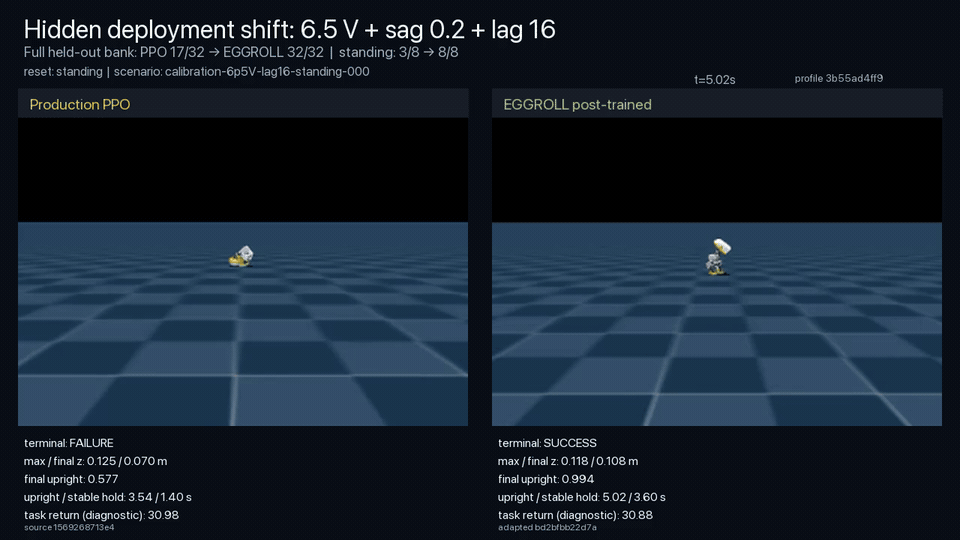
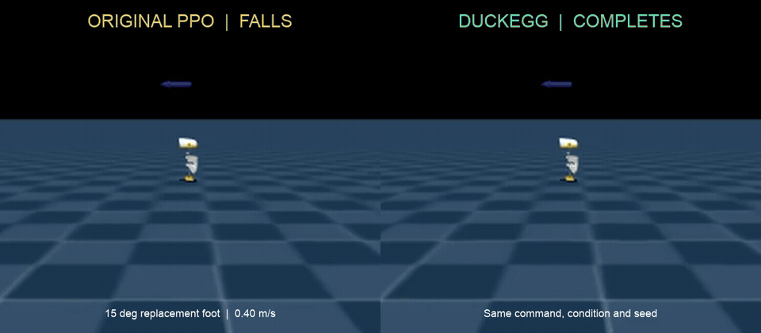

# DuckEgg

**Forward-only policy repair for deployed robots, powered by EGGROLL.**

<p align="center">
  
</p>

**Can a deployed robot policy be repaired against the outcome that actually matters,
without gradients, without changing its interface, and without rerunning its original
training pipeline?**

**DuckEgg is a working answer.** It starts with a sealed production ONNX policy, evaluates
narrow derivatives through the robot's real Rust control loop inside its registered MuJoCo
environment, and releases only a policy that passes explicit behavioral, non-regression,
runtime, routing and rollback gates.

On MicroDuck, DuckEgg has shown that it can:

- repair a standing policy under hidden power and actuator-delay conditions, improving
  stable terminal success from **17/32 to 32/32** while retaining **32/32** nominal success;
- adapt a walking policy to a simulated **15° replacement-foot geometry**, improving
  terminal success from **47/64 to 64/64 across two independent sealed banks**, repairing
  all 17 observed source failures while preserving every source success;
- modify only the final affine layer—**1,806 of 197,774 parameters (0.91%)**—while
  preserving the production `obs[1,61] -> actions[1,14]` ONNX contract; and
- reach the complete release gate in **3/3 independent walking runs** at a median
  **3.078 million requested optimization steps**, 16.6x below the frozen
  51.2-million-step reference.

A later single integrated campaign rejected four earlier candidates, stopped at its first
complete pass at generation 5, and used 2.565 million requested optimization steps plus
144,000 qualification steps. Even counting qualification, that is 2.709 million tracked
steps—18.9x below the historical run's optimization-only total—without weakening the
behavioral objective or release gates.

All current results are from a production-runtime digital twin; physical-robot validation
is the next proof.

> [!NOTE]
> DuckEgg is an independent extension of Pollen Robotics'
> [`microduck`](https://github.com/pollen-robotics/microduck) and
> [`microduck_rl`](https://github.com/pollen-robotics/microduck_rl). Their source is
> preserved in this monorepo; see [PROVENANCE.md](PROVENANCE.md) for exact revisions,
> licenses and the DuckEgg modification boundary.

## Watch the repairs

Click either image to play an evidence-bound side-by-side simulation. The left panel is the
unmodified production PPO policy; the right panel is its DuckEgg derivative. These are
matched rollouts in the actual registered MicroDuck task, not hand-authored animations.
The walking video shows the original generation-85 behavioral proof. The later efficiency
study produced different policy bytes while preserving the same source policy, 15° profile,
final-affine scope and behavioral/runtime release standard; its candidates are documented
in the linked machine records rather than represented by this video.

### StandUp: hidden voltage, sag and actuator delay

[](microduck_rl/docs/assets/eggroll_posttraining/eggroll_posttraining_hero_v1.mp4)

The policy is not told the hidden condition. It must recover from standing, sitting,
face-down and face-up starts and remain height- and orientation-qualified through the
terminal window. The inline sequence opens on the terminal contrast, then replays the
matched case: both policies start upright and fall; the PPO policy remains down, while
DuckEgg recovers and finishes upright.

| Held-out profile | Production PPO | EGGROLL derivative |
| --- | ---: | ---: |
| 6.5 V, voltage sag 0.2, 16-step delay | 17/32 | **32/32** |
| Nominal | **32/32** | **32/32** |

Every reset category improved under the shifted condition:

| Initial pose | Production PPO | EGGROLL derivative |
| --- | ---: | ---: |
| Standing | 3/8 | **8/8** |
| Sitting | 2/8 | **8/8** |
| Face-down | 5/8 | **8/8** |
| Face-up | 7/8 | **8/8** |

Mean task return fell from 35.94 to 33.67 while terminal success rose from 17/32
to 32/32. That matters: selection was driven by the explicit deployment acceptance test,
not by finding a policy that gamed the environment's shaped reward.

### Walking: a changed foot geometry

[](microduck_rl/docs/assets/eggroll_autopatch/walking_wedge_gen85_hero.mp4)

The second proof moved beyond episodic recovery into continuous locomotion. A hidden,
symmetric 15° wedge was applied to the replacement feet. Evaluation used four forward
commands—0.28, 0.32, 0.36 and 0.40 m/s—with matched world identities and identical case
seeds for the source and derivative. The video above is a new-bank 0.40 m/s case: the PPO
rollout terminates when the robot falls, while DuckEgg remains upright and completes the
full five-second episode under the same command, hardware profile and seed.

| 15° replacement-foot evaluation | Production PPO | DuckEgg | Failures repaired | Source successes lost |
| --- | ---: | ---: | ---: | ---: |
| First sealed bank | 24/32 | **32/32** | 8 | **0** |
| Independent confirmation bank | 23/32 | **32/32** | 9 | **0** |
| **Combined** | **47/64** | **64/64** | **17** | **0** |

The confirmation bank used 32 new, seed-disjoint cases. DuckEgg scored 8/8 at every speed
on both banks. Across the combined evidence, source success by speed was 12/16, 12/16,
14/16 and 9/16; DuckEgg achieved **16/16 at all four speeds**. All 128 accepted in-profile
source/adapted episodes passed independent production-runtime trace audits.

This establishes **zero observed in-profile regression across two independent sealed
banks**: DuckEgg retained all 47 cases the source passed and repaired all 17 cases it
failed. This is a finite behavioral result under the declared 15° replacement-foot
profile, not a claim about every possible robot state.

The original-foot cross-profile diagnostic was source 32/32 versus derivative 31/32. That
demonstrates why DuckEgg releases are deployment-scoped: a wedge-foot robot receives the
wedge-foot derivative, while an original-foot or unknown robot keeps the exact source
policy. DuckEgg turns policy specialization into an explicit, testable routing decision
rather than asking one network to compromise across every possible hardware configuration.

## What DuckEgg has proven

The result is a concrete product proof:

> Starting with a frozen production-format policy, DuckEgg can use forward-only EGGROLL
> search to repair a defined simulated deployment failure, reject superficially strong
> candidates that regress source behavior, and stop at the first candidate that passes the
> complete production-runtime release gate—without changing the policy interface or
> reopening its original training pipeline.

The important product idea is larger than either experiment. DuckEgg is a
**policy-maintenance and release layer** for embodied intelligence:

```text
deployed policy + measured failure + acceptance test + retention constraints
                                      │
                                      ▼
                         forward evaluations only
                                      │
                                      ▼
                      structured low-rank EGGROLL search
                                      │
                                      ▼
                   paired production-runtime validation
                                      │
                                      ▼
                 scoped derivative + evidence + rollback
```

The base policy can come from PPO, imitation learning, a foundation model or another
training pipeline. DuckEgg complements that stack with a way to improve the deployed
artifact against tests that may be binary, delayed, discontinuous, hardware-in-the-loop,
proprietary or otherwise non-differentiable.

## Why this matters

Robot policies are trained against a model of the world and deployed into the world
itself. Actuator latency, battery state, payload, wear, manufacturing variation,
calibration, surface properties and hardware revisions can all move a robot outside its
training distribution. Sim-to-real locomotion work explicitly identifies actuator
dynamics and latency as important transfer gaps, while rapid motor adaptation research
targets changing payloads, wear and terrain
([Tan et al., 2018](https://arxiv.org/abs/1804.10332),
[Kumar et al., 2021](https://www.roboticsproceedings.org/rss17/p011.html)).

The usual response—anticipate every variation during initial training—is necessary but
incomplete. It requires developers to predict the failure, encode it in a training
distribution, preserve the original trainer and simulator, and choose a differentiable or
dense reward before deployment. Real acceptance tests are often much simpler and harder:
did the robot finish, stay upright, satisfy the safety verifier, meet an energy budget or
pass a customer's test?

EGGROLL closes the loop between **what can be evaluated** and **what can improve a
policy**. It needs scores from forward execution, not gradients through the simulator,
robot, runtime or acceptance test. Its structured perturbations are designed to retain
batched-inference efficiency; the EGGROLL authors report up to 91% of pure batch-inference
throughput and substantial scaling advantages over naive evolution strategies
([Evolution Strategies at the Hyperscale](https://eshyperscale.github.io/)).

## How DuckEgg works

### 1. Seal the policy and failure contract

DuckEgg binds the source ONNX hash and `61 -> 14` interface to a behavioral capability,
a reversible deployment condition, and disjoint optimization, selection and release banks.
The source is never inferred from a filename, and task return remains diagnostic.

### 2. Calibrate before spending search compute

The source policy must expose a real but repairable failure under a predeclared condition.
Irrelevant and catastrophic conditions stop before optimization. The trunk center-of-mass
and payload follow-ons both did exactly that: neither produced the required incident, so
both ended at source-only calibration with zero optimizer evaluations.

### 3. Search only the declared parameter surface

EGGROLL evaluates low-rank perturbations with forward rollouts—no policy gradient,
differentiable reward or PPO update. In the current walking workflow, losing a source
success ranks worse than repairing another failure, and a shaping score cannot compensate
for behavioral failure.

### 4. Qualify against the real release path

Plausible candidates are replayed through the real Rust `robotd` scheduler, ONNX runtime,
previous-action state, scaling, filters, safety clamps and simulated `RobotIo` writes.
Two disjoint paired banks enforce case-by-case source retention. Every accepted episode
carries a trace audit, and training stops only after the complete candidate-bound gate
passes.

### 5. Route narrowly and retain rollback

An eligible derivative runs only on its attested deployment profile. Original or unknown
profiles retain the exact source bytes. The updater verifies identity and evidence,
health-gates signed activation, and preserves the previous source version for rollback.

## Inside DuckEgg

### DuckEgg's policy engine

[`microduck_rl/src/mjlab_microduck/autopatch/`](microduck_rl/src/mjlab_microduck/autopatch/)
contains DuckEgg's current policy-agnostic implementation:

- a sealed inventory of all nine production policies;
- artifact, capability, condition, campaign and release-scope contracts;
- deterministic source-fleet and generic paired A/B evaluators;
- registered-task diagnostics and exact seed-bank binding;
- requested and executed candidate, rollout and simulator-step accounting;
- resumable, gate-triggered candidate qualification and first-eligible stopping;
- non-pickle, campaign-bound checkpoint envelopes;
- output-layer-only ONNX export with numerical parity gates;
- capability-node and scheduler-edge coverage;
- case-by-case non-regression verification; and
- release-envelope construction that fails closed without routing evidence.

The implementation namespace and CLI remain `autopatch` and `eggroll-autopatch` for now.
The older StandUp-specific wrappers reproduce the first release; new policies use the
generic DuckEgg engine.

### Production Rust integration

[`microduck/`](microduck/) contains the robot software and the integration used by the
proof:

- `robotd --sim-eval` runs the real scheduler and control loop against simulated
  `RobotIo`;
- an evaluation-only policy trace exposes otherwise hidden control stages for independent
  auditing;
- policy loading checks the `61 -> 14` interface and exact ONNX hash;
- `xtask` packages evidence-bound model components;
- the updater supports signed, health-gated activation and exact rollback; and
- unknown or ineligible deployment profiles retain the source-policy route.

Physical and fake-device startup behavior remain unchanged and separate from the
evaluation-only path.

### One contract across a policy fleet

The source-acceptance suite covers all nine production policy artifacts—walking, stand,
sit/stand, ground pick, left and right kick, roller locomotion, roller crouch and roulade.
The deterministic fleet check passed **9/9 capability nodes and 8/8 scheduler-transition
edges** through the production-runtime trace. That establishes one common evaluation and
release contract across the fleet; StandUp and walking are the first two adapted classes.

## Evidence and reproducibility

| Evidence | Behavioral or release result | Requested simulator work | What actually ran |
| --- | --- | --- | --- |
| StandUp | **17/32 → 32/32**, with nominal **32/32** retained | 61.44M optimization steps; 51,200 candidates | historical fixed 100-generation search; ~5.5 h reported |
| Walking behavioral proof | **47/64 → 64/64**, with all 47 source successes retained | 51.2M optimization steps; 51,200 candidates | historical generation-85 derivative; 13,698.7 s campaign |
| Walking repeatability | **3/3** seeds passed all six release stages at generation 6 | 3.078M optimization steps per seed; 3.254M median all-in | exact persisted prefixes and independent qualification; training jobs continued to generation 9 |
| Walking integrated controller | generations 1–4 rejected; generation 5 passed the complete gate | 2.565M optimization + 0.144M qualification = **2.709M tracked steps** | one campaign stopped at its first eligible candidate |

The controlled comparison is against DuckEgg's own frozen walking EGGROLL reference. The
three-seed median is 16.634x lower on the primary optimization-step measure and 15.734x
lower after including current all-in work. The integrated run is 19.961x lower on
optimization steps and 18.9x lower even after adding qualification. These are not claims
against retraining or another optimizer, because neither baseline was run. The all-in
ratios are deliberately conservative but not fully like-for-like: the historical record
did not persist its equivalent qualification cost.

The historical 3.8- and 5.5-hour figures remain useful absolute records, but they are not
current time-to-patch estimates. The integrated record retains 4,840.9 seconds for its
qualification commands, not for the complete campaign, so DuckEgg does not publish an
unsupported end-to-end replacement time.

Evidence entry points:

- [public evidence index](evidence/results.json);
- [complete interaction-accounting study](microduck_rl/docs/experiments/eggroll_autopatch_efficiency_v1.md),
  with the [three-seed record](microduck_rl/docs/experiments/eggroll_autopatch_efficiency_multiseed_20260903_v1.json)
  and [integrated-stop record](microduck_rl/docs/experiments/eggroll_autopatch_efficiency_seed4_integrated_20260904_v8.json);
- [walking proof and supersession record](microduck_rl/docs/experiments/eggroll_autopatch_findings.md),
  including the [two-bank non-regression decision](microduck_rl/docs/experiments/walking_wedge_gen85_two_bank_non_regression_v2.json);
- [StandUp experiment record](microduck_rl/docs/experiments/eggroll_posttraining_2026-08.md)
  and [release verification](microduck_rl/policies/eggroll_posttraining/alpha_stand_lag16_v1/README.md); and
- [production deployment boundary](microduck/docs/robot/eggroll-policy.md).

The releasable example derivatives are in [`policies/`](policies/). Production PPO source
policies are in [`microduck/example_policies/`](microduck/example_policies/).

## Repository map

```text
.
├── README.md                         # product claim, evidence and operating model
├── PROVENANCE.md                     # upstream revisions and modification boundary
├── evidence/results.json             # compact public claim/evidence index
├── policies/                         # EGGROLL-derived ONNX examples and scope notes
├── assets/                           # README posters linked to evidence videos
├── microduck_rl/                     # MuJoCo tasks, PPO stack and DuckEgg engine
│   ├── src/mjlab_microduck/autopatch # current DuckEgg implementation namespace
│   ├── src/mjlab_microduck/tasks     # registered robot tasks and behavioral semantics
│   ├── scripts/                      # export, playback and Hugging Face job tools
│   ├── tests/                        # environment and DuckEgg regression tests
│   ├── policies/                     # evidence-bound StandUp reference release
│   └── docs/                         # product contracts and experiment records
└── microduck/                        # production Rust robot runtime
    ├── robotd/                       # 50 Hz scheduler, policy loop and sim-eval seam
    ├── duck-control/                 # observations, actions, filters and safety
    ├── updater/                      # signed activation, health gates and rollback
    ├── xtask/                        # evidence-bound model packaging
    ├── example_policies/             # nine production PPO source policies
    └── docs/robot/eggroll-policy.md  # deployment contract
```

Local runs, downloaded private evidence, caches and agent working state belong in ignored
`.local/`, `.scratch/` or `.codex/` directories. They are intentionally absent from the
public source snapshot.

## Quick start

### Inspect and test DuckEgg

Requirements: Python 3.12, [`uv`](https://docs.astral.sh/uv/) and, for actual-task
evaluation or search, a CUDA GPU.

```bash
cd microduck_rl
uv sync --extra eggroll
uv run eggroll-autopatch registry
uv run --with pytest pytest tests/
```

`HyperscaleES` is not vendored. The exact EGGROLL implementation is pinned by commit in
`microduck_rl/pyproject.toml` and is fetched by `uv`; the unrelated local Hyperscale
checkout used during development is deliberately excluded. That optional dependency is
licensed GPL-3.0-only, so the EGGROLL-enabled runtime environment is also subject to the
upstream HyperscaleES license; see [PROVENANCE.md](PROVENANCE.md).

### Build and test the robot runtime

Requirements: Rust 1.89+ stable. On macOS:

```bash
cd microduck
cargo test --workspace
cargo build --release --locked -p robotd
```

Linux also requires the system libraries documented in
[`microduck/CONTRIBUTING.md`](microduck/CONTRIBUTING.md).

### Reproduce a paired production-runtime evaluation

Build `robotd`, identify the ONNX Runtime dynamic library from the Python environment, and
run the generic evaluator against a sealed case bank:

```bash
cd microduck_rl
uv run eggroll-autopatch evaluate-ab \
  --runtime-repo ../microduck \
  --robotd ../microduck/target/release/robotd \
  --ort-dylib /absolute/path/to/libonnxruntime.so-or-dylib \
  --artifact alpha-walking \
  --adapted-policy ../policies/alpha_walking_wedge15_eggroll_gen85.onnx \
  --profile shifted=replacement-wedge-foot-pitch-15deg-v1 \
  --bank /path/to/sealed-bank.json \
  --output-dir ../.local/walking-ab
```

The committed experiment records contain the exact campaign, profile and policy hashes.
Private sealed-bank artifacts are not silently replaced with generated examples; supply
the declared bank if reproducing the published metric.

## Next steps

DuckEgg already closes the simulated deployment loop end to end: registered tasks, real
61D observation semantics, production Rust scheduling, ONNX loading, filters, safety,
simulated `RobotIo` writes, identity-bound traces, signed profile routing, activation and
rollback. Gate-aware stopping has reduced the walking benchmark's requested optimization
interactions by more than 10x. The next milestones turn that working digital-twin system
into a broadly deployable product:

1. **Run the first physical A/B.** Replay the same source, failure, derivative, scoped
   activation and rollback sequence on a MicroDuck with limits and policy identity visible
   to the operator.
2. **Connect telemetry to the release loop.** Turn real deployment failures and customer
   acceptance tests into sealed campaigns, while recording comparable end-to-end latency
   and accelerator cost.
3. **Test breadth without manufacturing a win.** Apply the engine to another production
   policy and an independently motivated incident. The center-of-mass and payload ladders
   found a robust source policy, so they will not be retuned after observing the result.
4. **Generalize beyond MicroDuck.** Demonstrate the same forward-only loop on another
   robot, policy architecture and non-differentiable acceptance test.

The ambition is a system that keeps a fleet's policies improving as hardware, operating
conditions and customer requirements change—without reopening every original training
project.

## License and attribution

DuckEgg's committed source and both upstream projects are licensed under Apache License
2.0, except for third-party components that retain their own notices. The upstream
`microduck` and `microduck_rl` license files are preserved inside their directories, and
source attribution is recorded in [PROVENANCE.md](PROVENANCE.md). In particular,
`microduck/tof/vendor/` retains its upstream license notice, and the optional, non-vendored
HyperscaleES dependency is GPL-3.0-only. MicroDuck model assets may carry additional
license terms documented by the upstream project.
